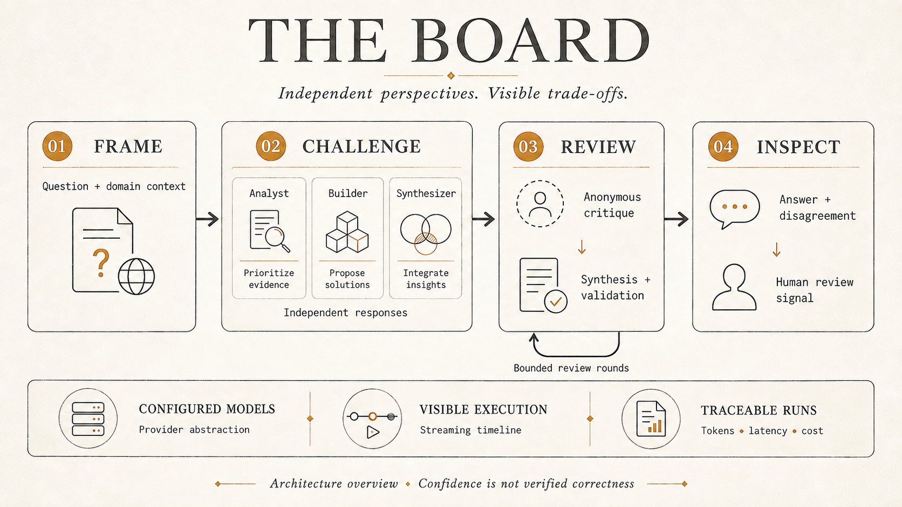

# The Board architecture

This is the current navigation and implementation overview. Existing contract examples have been split into smaller references; moving them does not change runtime behavior.

*Executive illustration. The source links below provide implementation evidence; a human-review signal does not make model output verified truth.*

## Read by responsibility

| Reference | Contents |
|---|---|
| [Data model](docs/architecture/data-model.md) | Existing schema examples and portability design rules |
| [Graph state](docs/architecture/graph-state.md) | Existing graph-state contract example |
| [Interfaces and API inventory](docs/architecture/interfaces.md) | Existing API, provider, tracing, and persona interface examples |
| [Phase 2 contract](PHASE2-CONTRACT.md) | Authoritative streaming request/event contract |
| [Deployment](docs/deployment.md) | Intended host, evidence, and readiness gaps |
| [Local setup](docs/setup-local.md) | Configuration and onboarding prerequisites |

Extracted examples are specifications, not generated source documentation. Consult actual types and routes before changing code; follow AGENTS.md when a frozen contract needs revision.

## Data Model

See the [data model reference](docs/architecture/data-model.md) and [source schema](src/lib/db/schema.ts).

## LangGraph State Interface

See the [graph-state reference](docs/architecture/graph-state.md) and [source state](src/lib/graph/state.ts).

## Key Interfaces

See the [interface reference](docs/architecture/interfaces.md) and the authoritative [streaming contract](PHASE2-CONTRACT.md).

## Runtime flow

The protected Next.js application selects a domain/workspace and mode. Quick uses a single-model route. The debate route builds a LangGraph flow and returns an SSE stream consumed with fetch and a ReadableStream reader.

Graph nodes collect independent responses, anonymize cross-review, synthesize, and validate. Parallel workers return reducible records, cost and diagnostic flags; serial coordination nodes own scalar phase/round transitions and fan-out after a completed batch. Compare ends after independent responses. Debate and Deep enforce maximum round counts of two and four respectively. A round is one complete review → synthesis → validation cycle, numbered from 1 in state, database responses and SSE. The round advances only when another cycle will run. Convergence requires valid, current-round agreement from both non-lead validators; invalid, missing or failed output cannot count. Unresolved disagreement or incomplete validation at the cap retains the final synthesis and emits a human-review signal; it is not a durable pause-and-resume workflow.

Provider and model settings are configuration-driven. The server resolves active persona mappings, calls through the tracing wrapper, and records response usage/cost. The streaming UI and transcript view expose execution details. Tracing needs configured Langfuse credentials; a wrapper alone does not prove trace delivery.

Post-stream scoring invokes four model judges. Successful finite scores in [0, 1], including zero, contribute to the aggregate. Metric details retain success/failure status and failure reasons; no successful metrics yields a null score and unavailable outcome. Partial evaluations may show available scores but cannot update context. Only complete successful evaluations at the existing threshold can update domain context. Filesystem writes and background completion need host-specific validation. A score threshold does not establish correctness or a human-reviewed publication gate.

## Implementation evidence

| Area | Source |
|---|---|
| Protected entry and workspace selection | [page.tsx](src/app/page.tsx) |
| Auth and role checks | [auth config](src/lib/auth/config.ts), [middleware](src/middleware.ts) |
| Streaming API | [debate route](src/app/api/debate/route.ts) |
| Graph assembly and convergence | [graph](src/lib/graph/graph.ts), [edges](src/lib/graph/edges.ts) |
| Provider configuration | [provider modules](src/lib/providers), [persona resolver](src/lib/quick/resolve-persona.ts) |
| Tracing and cost | [traced client](src/lib/providers/traced.ts), [cost calculation](src/lib/providers/cost.ts) |
| Scoring and context hook | [post-stream evaluation](src/lib/streaming/eval-after-stream.ts) |
| Quality automation | [CI workflow](.github/workflows/quality.yml) |

## Important distinctions

- Vercel is a documented target, not a verified deployment. The route has a five-minute application timer but no exported host duration setting.
- Trigger.dev is deferred and is not a runtime dependency in this checkout.
- The database-backed provider resolver reads stored API keys; encryption/rotation are not asserted as implemented.
- Langfuse hosting location is configurable; GCP hosting is not established by this repository.
- Deep mode integration and stale availability labels need validation before a public live-mode claim.
- Strict parsing and compiled-graph control flow are tested without live providers. Judge scores remain uncalibrated judgments, not proof of factual correctness.
- Local `file:` SQLite cannot be imported by the current Edge middleware; local page requests fail before auth. This is a separate auth/database runtime compatibility issue.
- Contract examples and aspirational requirements are not benchmarks or proof of production readiness.

## Change control

Keep standing invariants in [AGENTS.md](AGENTS.md). Keep feature rationale and acceptance in the [feature lifecycle](features/README.md). Retain product scope in [REQUIREMENTS.md](REQUIREMENTS.md); update a contract only through its prescribed review gate.
