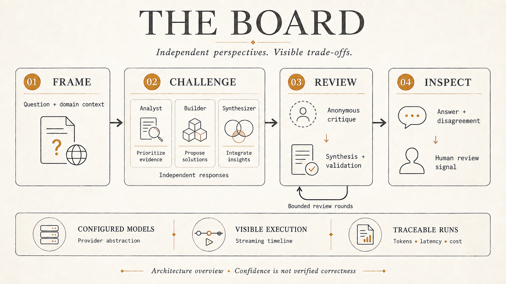

# The Board

**A multi-model workbench for examining technical decisions, exposing disagreement, and inspecting how an answer was formed.**

[](https://github.com/aidevcode9/the-board/actions/workflows/quality.yml)

The Board gives engineering teams and interview candidates a structured way to compare independent responses, challenge assumptions, and inspect a synthesis. Its value is the visible reasoning record and trade-offs; model agreement is not proof of correctness.



*Architecture illustration, not an application screenshot. The human-review signal appears when bounded debate ends with unresolved disagreement; it is not a universal approval gate.*

## Explore in two minutes

- **Product and engineering leaders:** inspect the workflow above and the [current architecture and limitations](ARCHITECTURE.md).
- **Engineering interviewers:** follow the [debate route](src/app/api/debate/route.ts), [graph](src/lib/graph/graph.ts), and [streaming tests](__tests__/streaming).
- **Contributors:** start with [local setup](docs/setup-local.md) and the [feature lifecycle](features/README.md).

**Current status:** implementation exists for Quick, Compare, Debate, streaming transcripts, evaluator integration, and domain-context updates. These are code-backed capabilities, not a claim that every path has been validated on a live host. Deep mode has graph support but remains under integration review in the task ledger. A public application URL has not been verified.

## What is implemented

| Capability | Evidence | Practical boundary |
|---|---|---|
| Google sign-in, invite checks, role checks | [Auth](src/lib/auth/config.ts), [middleware](src/middleware.ts) | Authenticated app; no public replay yet |
| Configurable providers and persona mappings | [Providers](src/lib/providers), [persona resolution](src/lib/quick/resolve-persona.ts) | Active mappings and credentials required for live calls |
| Independent responses, cross-review, synthesis, validation | [Graph nodes](src/lib/graph/nodes), [routing](src/lib/graph/edges.ts) | Debate capped at 2 rounds; Deep at 4 |
| Streaming timeline and transcript inspection | [Board components](src/app), [streaming](src/lib/streaming) | Disconnect and hosting limits still matter |
| Cost calculation and tracing wrapper | [Cost](src/lib/providers/cost.ts), [tracing](src/lib/providers/traced.ts) | Cost uses configured rates; tracing needs configuration |
| Judge scores and context-update hook | [Evaluators](src/lib/eval), [post-stream hook](src/lib/streaming/eval-after-stream.ts) | Scores are model judgments; background completion and writable storage need host verification |

Provider brands are configurable assignments, not guarantees about which model is best at a role. Older specifications contain proposed features and illustrative commercial figures; use code and this status summary for current capability claims.

## Why the design is worth inspecting

1. **Independent first responses:** multiple perspectives are collected before cross-review.
2. **Anonymous critique and bounded rounds:** the flow is designed to reduce deference and runaway debate, without claiming to eliminate either.
3. **Inspectable execution:** transcripts, cost estimates, evaluator details, and disagreement signals make trade-offs visible.

Quick uses a single-model path. Compare stops after independent responses. Debate adds critique, synthesis, and validation. Deep allows a larger bounded round count. Cost and latency depend on actual provider calls and configured rates; mode labels are not benchmarks.

## Known limitations and next work

- Validation currently has a text fallback that can misread negated agreement. The [active improvement plan](features/active/portfolio-credibility/03_IMPLEMENTATION_PLAN.md) makes strict validation the next implementation slice.
- There is no calibrated correctness claim or published controlled benchmark demonstrating superiority over a single-model baseline.
- A reviewer-friendly sample transcript and replay are planned, not available in this release.
- Some mode availability labels are stale relative to backend implementation; verify the full UI path before advertising a mode as live.
- Trigger.dev durable execution and further security/evaluation tooling are deferred.
- Vercel is the intended host, but a deployment URL and host configuration have not been verified. See [deployment evidence and readiness](docs/deployment.md).

## Run locally

Node.js 20 is used by CI. Configure database, auth, and provider settings before expecting a working live session.

```sh
git clone https://github.com/aidevcode9/the-board.git
cd the-board
npm ci
```

Continue with [local setup](docs/setup-local.md), including the first-user invitation and persona-mapping prerequisites. This is not a zero-configuration demo.

## Quality and working documents

CI runs lint, TypeScript checking, Vitest, and build. The badge links to actual workflow results; it does not imply live-model evaluation or deployment verification.

```sh
npm run lint
npm run typecheck
npm run test
npm run build
```

[Requirements](REQUIREMENTS.md) describe the product and phased intent. [Architecture](ARCHITECTURE.md) links the technical contracts. [EVALS.md](EVALS.md) describes evaluation plans; [STATUS.md](STATUS.md) and [CHECKPOINT.md](CHECKPOINT.md) track execution. New work uses [feature folders](features/README.md).

## Visibility and licensing

This repository is public for inspection. No open-source license has been added to this project; public visibility does not itself grant an open-source license. The licensing decision for Operational Discovery Workbench does not automatically apply here.
